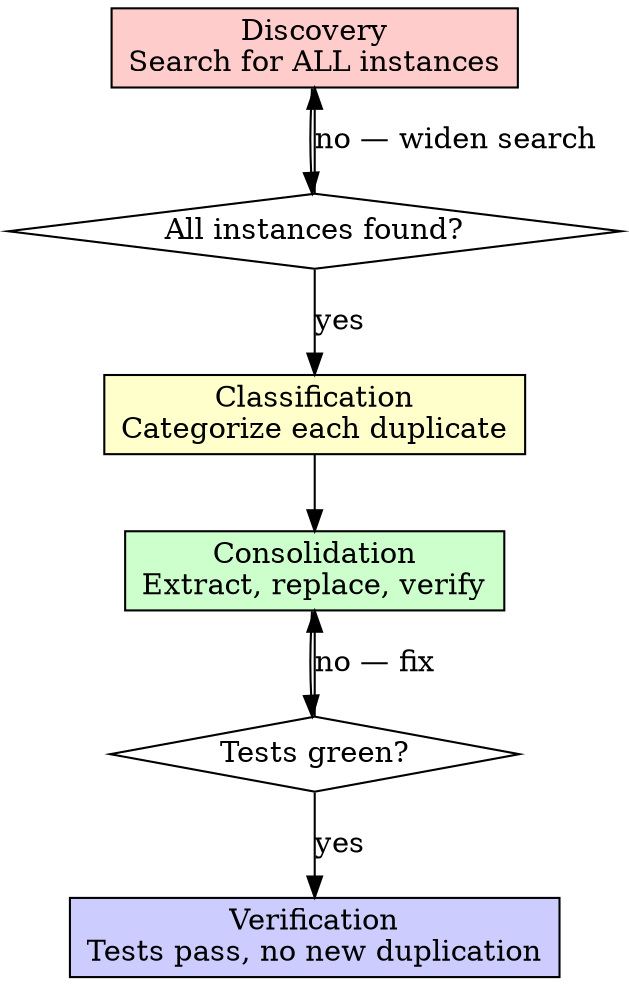
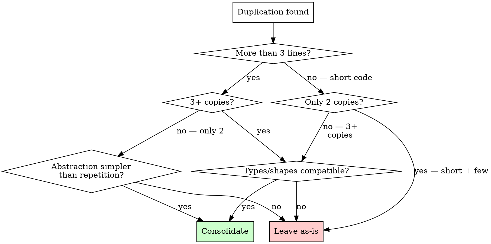

# Deduplicating Code

## Overview

Duplication is the root cause of divergence bugs. When the same logic exists in two places, one gets updated and the other doesn't. The fix is never "I'll keep them in sync" — the fix is one canonical location.

**Core principle:** SEARCH before you write. Every helper, utility, and shared pattern has ONE home. Find it or create it — never duplicate it.

**Violating the letter of this process is violating the spirit of this process.**

## The Iron Law

```
NO NEW HELPER FUNCTION WITHOUT SEARCHING FOR AN EXISTING ONE FIRST
```

If you haven't grepped the codebase for similar functionality, you cannot write a new function.

**No exceptions:**
- Not for "quick" helpers
- Not for "slightly different" variants
- Not for "just this module"
- Not because "I'll deduplicate later"

## When to Use

**Always:**
- Before writing any helper, utility, or shared function
- During code review (self or peer)
- During audit passes
- After any refactoring that moves or consolidates code
- When fixing a bug and finding the same bug exists elsewhere

**Especially when:**
- Multiple modules solve the same problem
- You're about to write something that "feels familiar"
- A function name matches something you've seen before
- You're wrapping an existing function with minor changes

**When NOT to use this skill:**
- **Generated code** — protobuf stubs, serde derives, macro output. These are generated, not authored. Deduplicating them fights the generator.
- **Vendored / third-party code** — code copied into the repo intentionally for isolation. Don't modify vendored dependencies.
- **Code scheduled for deletion** — if a tracked plan item removes the module entirely, deduplicating within it is wasted work. Verify the plan item exists and is current before skipping.
- **Cross-language boundaries** — similar logic in Rust and Go (or shell scripts) is not duplication. Different languages have different idioms.

## The Four Phases

You MUST complete each phase before proceeding to the next.



### Phase 1: Discovery

**Search for ALL instances, not just the one you noticed.**

Duplication never exists in only two places. If you found two copies, assume there's a third.

**Search strategy (execute ALL of these):**

1. **Function name search** — grep for the function name and obvious synonyms
   ```bash
   # Found `parse_timestamp`? Search for ALL timestamp-related functions
   rg "fn.*timestamp|fn.*time.*iso|fn.*utc_now|fn.*date.*format" --type rust
   ```

2. **Logic pattern search** — grep for the distinctive operation, not the name
   ```bash
   # Found SHA256 hashing? Search for ALL hashing patterns
   rg "Sha256|sha2|digest|hash.*hex" --type rust
   ```

3. **Import search** — what else imports the same dependency for the same purpose?
   ```bash
   # Found chrono usage? Who else uses chrono?
   rg "use chrono" --type rust
   ```

4. **Structural search** — look for same shape with different names
   ```bash
   # Found `fn foo(path: &Path) -> Result<String>`?
   # Search for all functions with same signature shape
   rg "fn \w+\(.*Path.*\) -> Result<String" --type rust
   ```

**Mandatory:** Record every instance with file:line before proceeding.

### Phase 2: Classification

Categorize each instance. The category determines the consolidation strategy.

| Category | Description | Example | Strategy |
|----------|-------------|---------|----------|
| **Exact copy** | Identical logic, same names | Two `parse_config()` functions | Delete one, import the other |
| **Near copy** | Same logic, different names/types | `parse_yaml_config()` vs `load_yaml()` | Extract shared function, parameterize |
| **Structural** | Same pattern, different data | Multiple `fn from_row(row: &Row) -> Self` with identical structure | Extract generic, or accept if < 4 lines |
| **Semantic** | Different code, same effect | `Utc::now().to_rfc3339()` vs `chrono::Utc::now().format("%+").to_string()` | Canonicalize on one approach |
| **Wrapper** | Local function wrapping shared one | `fn now() -> String { utc_now_iso8601() }` | Delete wrapper, use original directly |
| **Diverged** | Was a copy, evolved differently | `process_v1()` and `process_v2()` with 80% overlap | Refactor to share common core |

### When NOT to Consolidate

Per CLAUDE.md: "Three similar lines > a premature abstraction."



**Do NOT consolidate when:**
- The repeated code is 3 lines or fewer AND exists in only 2 places
- The cases differ in types, field names, or return shapes enough that a generic abstraction would be MORE complex than the repetition
- The repetition is in test setup code that's clearer when explicit
- Consolidating would create a dependency between modules that should be independent

### Phase 3: Consolidation

**One duplicate at a time. Test after each.**

For each duplicate set:

1. **Choose the canonical location**
   - **Check the project's conventions first** — look for a shared utilities section in CLAUDE.md, a central `lib.rs`, a `utils/` directory, or similar. The project tells you where shared code lives.
   - Shared utilities → project's designated shared module
   - Module-specific → the module that owns the domain concept
   - If unclear, the module that was written first gets priority

2. **Extract or identify the canonical implementation**
   - If one copy is better (handles more edge cases, better error messages), use that one
   - If all copies are equivalent, use the one in the canonical location
   - If none is great, write the definitive version once

3. **Replace all call sites**
   - Replace one caller at a time
   - Run tests after EACH replacement
   - Don't batch replacements — if tests fail, you need to know which one broke
   - **Concurrency constraint:** Only dispatch parallel agents when replacements touch **completely different files**. If two replacements edit the same file, execute them sequentially. Concurrent edits to the same file produce silent corruption.

4. **Delete the duplicates**
   - Only after all callers use the canonical version
   - Only after tests pass
   - Search one more time to make sure you didn't miss any

**The replacement pattern:**
```
BEFORE (duplicated):
  module_a/foo.rs:  fn parse_timestamp(s: &str) -> Result<DateTime> { ... }
  module_b/bar.rs:  fn parse_ts(input: &str) -> Result<DateTime> { ... }
  module_c/baz.rs:  fn timestamp_from_str(s: &str) -> Result<DateTime> { ... }

AFTER (canonical):
  shared/lib.rs:    pub fn parse_timestamp(s: &str) -> Result<DateTime> { ... }
  module_a/foo.rs:  use shared::parse_timestamp;
  module_b/bar.rs:  use shared::parse_timestamp;
  module_c/baz.rs:  use shared::parse_timestamp;
```

### Good vs. Bad Consolidation

<Bad>

"Found `utc_now_iso8601()` in lib.rs. My module needs a timestamp with a different format, so I'll write my own."

```rust
// module_a/timestamps.rs — BAD: forked the shared function
fn formatted_now() -> String {
    Utc::now().format("%Y-%m-%d %H:%M:%S").to_string()
}
```

Why bad: Next person searching for timestamp functions won't find this. The shared function could be extended with a format parameter, keeping one canonical location.
</Bad>

<Good>

"Found `utc_now_iso8601()` in lib.rs. My module needs a different format. I'll extend the shared function."

```rust
// lib.rs — GOOD: extended the canonical function
pub fn utc_now_iso8601() -> String { Utc::now().to_rfc3339() }
pub fn utc_now_formatted(fmt: &str) -> String { Utc::now().format(fmt).to_string() }

// module_a/foo.rs — uses the shared function
use crate::utc_now_formatted;
let ts = utc_now_formatted("%Y-%m-%d %H:%M:%S");
```

Why good: One location for all timestamp logic. New callers find it immediately. Bug fixes propagate to all callers.
</Good>

### Phase 4: Verification

**MANDATORY — do not skip.**

1. **Tests pass** — Full test suite, not just the module you changed
2. **No new duplication** — Re-run Phase 1 search to confirm you didn't introduce new copies
3. **No wrapper functions** — Grep for functions that just call the canonical one with no added logic
4. **Imports clean** — No unused imports from deleted code
5. **Documentation updated** — If the project tracks shared utilities (like CLAUDE.md's "Shared Utilities" section), update it

## Preventing Future Duplication

After consolidating, prevent recurrence:

1. **Document the canonical location** — If the project tracks shared utilities (e.g., a "Shared Utilities" section in CLAUDE.md, a `lib.rs` exports list), add the new function to that list immediately. This is the single most effective prevention — future agents search the list before writing.
2. **Name clearly** — The canonical function name should be the obvious first guess when searching. `utc_now_iso8601` is findable; `format_time` is not.
3. **Make it findable** — Put it where someone would look first (the project's shared module, not buried in a domain module)
4. **Update mechanical detection** — If the project has an audit script, add a check for the specific duplication pattern you just fixed (e.g., `rg "Sha256::new\(\)" --type rust` to catch non-canonical hashing)
5. **Check for existing wrappers** — After adding a shared function, grep for any existing wrappers or local reimplementations that should now be replaced

## Red Flags — STOP and Search

If you catch yourself thinking:
- "I'll just write a quick helper"
- "This is slightly different, it needs its own function"
- "I'll deduplicate later"
- "It's only duplicated in two places"
- "This module shouldn't depend on that one"
- "I know there's a shared version but mine is simpler"
- "Wrapping it makes the API cleaner for my module"
- "Tests don't need to be DRY"
- Copying a function and modifying it instead of parameterizing
- Writing `fn foo() { shared::foo() }` (pure wrapper)
- Adding a parameter where a shared function already handles the case

**ALL of these mean: STOP. Run Phase 1 search. Find the canonical version.**

## Common Rationalizations

| Excuse | Reality |
|--------|---------|
| "Mine is slightly different" | Parameterize the shared version. 90% same = same function. |
| "I'll deduplicate later" | You won't. Technical debt accrues interest. Do it now. |
| "Only two copies" | If it's > 3 lines, two is enough. One bug = two fixes. |
| "Different module, different concern" | Logic doesn't care about module boundaries. Same logic = one function. |
| "Adding a dependency feels wrong" | Duplication IS the wrong dependency — an invisible, unsynchronized one. |
| "My wrapper adds clarity" | A wrapper with no logic is noise, not clarity. Use the original. |
| "Search takes too long" | Grep takes 2 seconds. Debugging a divergence bug takes 2 hours. |
| "Tests are different, duplication is fine" | Test setup duplication causes maintenance burden. Extract test helpers. |
| "It's only 5 lines" | Five lines duplicated 4 times = 20 lines to maintain. Extract once. |
| "The shared version doesn't handle my case" | Extend the shared version. Don't fork it. |

## Common Mistakes

| Mistake | Fix |
|---------|-----|
| Searching only by function name | Search by logic pattern, imports, AND name |
| Stopping at the first two copies | Assume there's a third. Search exhaustively. |
| Batching all replacements then testing | Replace one caller, test, repeat |
| Creating a shared function that's too generic | Parameterize only what varies. Don't over-abstract. |
| Leaving the wrapper "for now" | Delete immediately. Wrappers are duplication in disguise. |
| Moving but not deleting the original | Grep for the old name after moving. Delete all originals. |
| Consolidating without updating docs | If the project tracks shared utilities, add to the list |
| Consolidating 3-line patterns into a generic | Three similar lines > a premature abstraction |

## Quick Reference

| Duplication Type | Detection Method | Fix |
|-----------------|------------------|-----|
| Exact copy | `rg "fn function_name"` | Delete copy, import original |
| Near copy | `rg "pattern_in_body"` | Parameterize and extract |
| Wrapper | `rg "fn.*\{.*shared_fn.*\}"` | Delete wrapper, use original |
| Structural | Manual review of similar shapes | Extract if > 3 copies AND > 3 lines |
| Semantic | `rg "dependency_name"` | Canonicalize on one approach |
| Diverged | Diff the two implementations | Refactor to share common core |

## Verification Checklist

Before marking deduplication complete:

- [ ] Phase 1 search executed with ALL four search strategies
- [ ] Every instance recorded with file:line
- [ ] Each instance classified by category
- [ ] Canonical location chosen with rationale
- [ ] Each caller replaced individually (not batched)
- [ ] Tests run after each individual replacement
- [ ] Full test suite green after all replacements
- [ ] Re-ran Phase 1 search — no remaining copies
- [ ] No wrapper functions left
- [ ] No unused imports
- [ ] Shared utilities documentation updated (if applicable)
- [ ] Checked that consolidation didn't introduce premature abstraction

Can't check all boxes? You skipped a step. Go back.

## Integration

**Related skills:**
- **superpowers:verification-before-completion** — Verify tests pass before claiming deduplication is done
- **superpowers:systematic-debugging** — If consolidation breaks something, follow debugging process
- **superpowers:test-driven-development** — If extracting new shared function, write test first

**Works with project tools:**
- Audit scripts that detect duplication mechanically
- Linters that flag unused code (post-consolidation cleanup)
