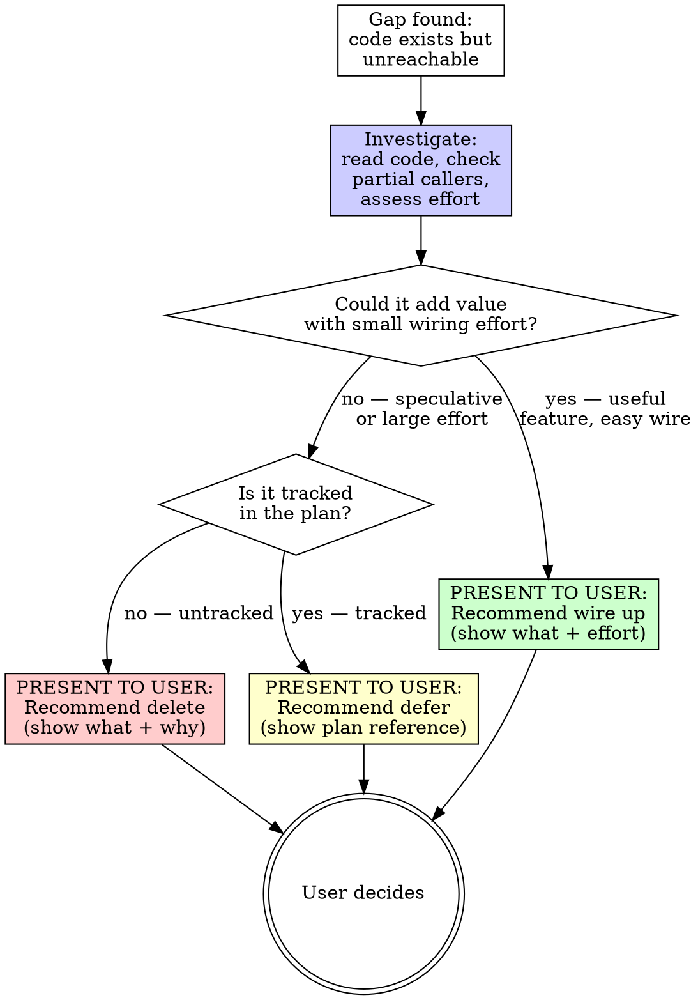

# Detecting Implementation Gaps

## Overview

The most dangerous incomplete code is code that LOOKS complete. A function exists, has tests, handles errors properly — but nothing ever calls it. The feature is 90% done. The last 10% (wiring, registration, dispatch) was never written. The 90% is dead code masquerading as a shipped feature.

**Core principle:** Implementation without invocation is dead code. Every code path must be reachable from an entry point, or it doesn't exist.

**Violating the letter of this process is violating the spirit of this process.**

## The Iron Law

```
NO IMPLEMENTATION IS COMPLETE UNTIL IT'S REACHABLE FROM AN ENTRY POINT
```

If you can't trace an unbroken call chain from `main()`, a CLI command, an API handler, a webhook, a controller reconcile loop, or a signal/event listener down to your code — it's not done.

**No exceptions:**
- Not "the caller will be added when we need it"
- Not "the trait is implemented, someone just needs to register it"
- Not "the test proves it works"

**One narrow exception:** If the missing wiring is a tracked, unchecked item in the project plan (e.g., PLAN.md), the implementation is incomplete but acknowledged. Record the gap explicitly in the plan as a blocking task. "It'll be wired up eventually" without a tracked item is NOT this exception — that's wishful thinking.

Tests proving isolated behavior are NOT proof of integration. A function that passes unit tests but is never called from production code is dead code with good test coverage.

## When to Use

**Always:**
- After implementing a feature (before claiming completion)
- During code review
- During audit passes
- When onboarding to an unfamiliar codebase
- When you find a function with zero callers

**Especially when:**
- A trait is implemented but you're not sure it's registered
- A CLI command is defined but might not be wired to the argument parser
- A config field is parsed but you're not sure it's consumed
- An error variant exists but you've never seen it constructed
- Code was written in phases and a later phase "would wire it up"
- A refactoring moved code and the call sites might not have followed

**When NOT to use this skill:**
- **Library public APIs** — `pub fn` items in library crates are consumed by external crates. Zero internal callers is expected. Check downstream crates, not the library itself.
- **Trait-required methods** — Methods required by a trait contract (`Default::default`, `Display::fmt`, serde `Deserialize`) are invoked by the framework/runtime, not by your code. The "caller" is the derive macro or generic bound.
- **Derive-generated code** — Serde, Clap, and other derive macros generate callers invisible to grep. A `#[derive(Deserialize)]` struct's fields ARE consumed — by the generated `deserialize()` impl.
- **Feature-gated code** — Code behind Cargo features (`#[cfg(feature = "...")]`) may have no callers in the default feature set. Check with `--all-features` before flagging.

## The Three Phases

You MUST complete each phase before proceeding to the next.

### Phase 1: Trace Down (Entry Points → Leaves)

**Start from EVERY entry point and trace what's reachable.**

Entry points depend on the application type:

| Application Type | Entry Points |
|-----------------|-------------|
| **CLI** | `main()`, each subcommand handler, signal handlers |
| **Web server** | Each route handler, middleware chain, startup/shutdown hooks |
| **Library** | Each `pub` function in the crate root or public modules |
| **Operator/Controller** | Each reconcile loop, webhook handler, health probe |
| **Daemon** | Event loop, file watchers, timer callbacks, signal handlers |
| **Plugin** | Each trait implementation method that the host calls |

For each entry point:

1. **List what it calls directly** — function calls, method calls, trait dispatches
2. **Follow registries and dispatchers** — if it dispatches through a registry (e.g., `ProviderRegistry`), check what's registered
3. **Follow config-driven branches** — if behavior depends on config values, trace ALL branches, not just the common ones
4. **Note unreachable branches** — code behind `if false`, impossible match arms, features behind unset flags

```
Entry point: `cli::apply::run()`
  → calls reconciler::reconcile()
    → calls registry.get_provider(name)
      → REGISTERED: ProviderA, ProviderB, ProviderC  ← check each
      → NOT REGISTERED: ???  ← anything implementing the trait but not in the registry?
    → calls registry.get_configurator(name)
      → REGISTERED: ConfigA, ConfigB  ← check each
      → NOT REGISTERED: ???
```

**Phase 1 is complete when you have traced from every entry point in the table above. Do not proceed to Phase 2 until this is done.**

### Phase 2: Trace Up (Implementations → Entry Points)

**Start from EVERY implementation and trace whether it reaches an entry point.**

This catches what Phase 1 misses — code that exists but was never connected.

**What to trace:**

1. **Trait implementations** — For each `impl Trait for Struct`, verify the struct is registered/constructed somewhere reachable
   ```bash
   # Find all trait implementations (handles qualified paths like crate::Trait)
   rg "impl [\w:]+ for \w+" --type rust

   # For each, verify the struct is constructed in reachable code
   # (substitute actual struct name for StructName)
   rg "StructName::new|StructName \{" --type rust
   ```

2. **Public functions** — For each `pub fn`, verify at least one caller exists outside tests
   ```bash
   rg "pub fn function_name" --type rust  # definition
   rg "function_name\(" --type rust       # callers (exclude definition line)
   ```

3. **Config fields** — For each deserialized field, verify it's read somewhere
   ```bash
   rg "field_name" --type rust  # should appear in both struct def AND logic
   ```

4. **Error variants** — For each error enum variant, verify it's constructed somewhere
   ```bash
   rg "ErrorType::VariantName" --type rust  # construction sites
   # Also check #[from] variants — those are constructed via ? operator
   ```

5. **CLI commands/subcommands** — For each command definition, verify it's in the argument parser AND has a handler
   ```bash
   rg "Command::new|\.subcommand" --type rust  # registration
   rg "matches.*subcommand|=> handle_" --type rust  # dispatch
   ```

6. **Event/message types** — For each event type, verify it's both emitted AND consumed
   ```bash
   rg "Event::TypeName" --type rust  # should have both emit and handle sites
   ```

**Phase 2 is complete when you have traced from every implementation back to an entry point (or confirmed it's unreachable). Do not proceed to Phase 3 until this is done.**

### Phase 3: Gap Analysis and Resolution

**For each gap, INVESTIGATE before deciding. Then PRESENT findings to the user.**

Deletion is destructive and irreversible. Dead code may represent an unfinished feature that could add value with a small amount of wiring work. You MUST investigate each gap independently before proposing an action, and you MUST present your findings and recommendations to the user for approval before making changes.

**Investigation checklist (for each gap):**
1. **Read the dead code** — understand what it does and what problem it solves
2. **Check for partial callers** — is there a code path that SHOULD call this but uses something else instead?
3. **Assess wiring effort** — would connecting this to an entry point be trivial (a few lines) or substantial?
4. **Evaluate added value** — would wiring this up provide useful functionality to users?
5. **Check the plan** — is this referenced in PLAN.md, COMPLETED.md, or design docs?



**Presenting findings to the user:**

For each gap, present a one-line summary with your recommendation. Group by recommended action:

```
## Implementation Gaps Found

### Recommend: Wire Up (adds value with small effort)
- `rollback_apply()` in reconciler — fully implemented rollback with backup restore.
  Wiring: add `cfgd rollback <apply-id>` subcommand (~20 lines). Useful for users.
- `interpolate_env()` in config — env var substitution in config values.
  Wiring: call from config loader (~5 lines). Common user expectation.

### Recommend: Delete (speculative, no planned use)
- `PresentYamlRequest` / `PresentYamlResponse` — unused request/response types
  in generate module. No callers, no plan reference, no obvious use case.

### Recommend: Defer (tracked in plan)
- `check_locked_violations()` — Phase 9 composition safety check.
  Referenced in PLAN.md section "Composition Engine."

How would you like to proceed with each group?
```

**NEVER delete, wire up, or defer without user approval.** Present the table, wait for the user's decision, then execute.

**Completion gate:** This skill is NOT complete until the user has decided on EVERY finding — wire up, delete, and defer. Do not move on to other work, other skills, or claim completion while any finding has no user decision. Partial resolution (e.g., "wire-ups done, deletions pending") means the skill is still in progress. Go back and step through the remaining items.

**Concurrency constraint:** When implementing resolutions, only dispatch parallel agents when their changes touch **completely different files**. If two resolutions edit the same file, they MUST be executed sequentially — one agent at a time, verified between each. Concurrent edits to the same file produce silent corruption that compiles by luck, not design.

## Gap Categories

| Category | Symptom | Example | Fix |
|----------|---------|---------|-----|
| **Dead registration** | Trait implemented but never registered in registry/dispatcher | `impl PackageManager for Snap` exists, not in `ProviderRegistry::new()` | Add to registry |
| **Orphaned handler** | Function exists, no route/command/dispatch calls it | `handle_export()` defined, no CLI subcommand for "export" | Add subcommand + dispatch |
| **Config without consumer** | Field parsed from YAML/JSON but never read in logic | `config.max_retries` deserialized, reconciler ignores it | Add logic that reads the field |
| **Error without constructor** | Error variant defined, nothing produces it | `CfgdError::RateLimited` exists, no code returns it | Wire to the code path that should produce it, or delete |
| **Partial pipeline** | Steps 1–4 of 5 exist, step 5 never written | File download, checksum, extract, install exist — no post-install verification | Write the missing step |
| **Test without integration** | Unit tests pass for isolated function that's never called | `test_parse_module()` passes, `parse_module()` has no production callers | Wire function into production code, or delete both |
| **One-way event** | Event emitted but no handler, or handler exists but event never emitted | `DriftDetected` event constructed, no listener processes it | Add the missing emit or handle side |
| **Feature behind dead flag** | Code gated on config/feature flag that's never set/enabled | `if config.experimental_feature { ... }` — nothing sets `experimental_feature` | Make it reachable (add to config docs/defaults) or delete |

## Red Flags — STOP and Trace

If you catch yourself thinking:
- "It's implemented, someone just needs to register it"
- "The tests prove it works"
- "It'll be wired up in the next phase"
- "The trait is implemented, that's enough"
- "The config field is there, the code will use it eventually"
- "This error variant is for completeness"
- "The function is public, anyone can call it"
- "I'll add the CLI command later"
- "The handler exists, it just needs a route"
- Implementing a struct without checking how it gets constructed
- Adding a config field without adding logic that reads it
- Defining an error variant without writing the code that produces it
- Implementing a trait without registering the implementor

- Moving to another skill or task while findings are still unresolved
- "The wire-ups are done, I'll come back for deletions"

**ALL of these mean: STOP. Trace from entry point to your code. If the chain is broken, it's not done. If findings are unresolved, the skill is not complete.**

## Common Rationalizations

| Excuse | Reality |
|--------|---------|
| "Tests prove it works" | Tests prove isolated behavior. Integration proves it's reachable. |
| "It'll be wired up later" | If "later" isn't a tracked, unchecked item in the plan, it's "never." |
| "The trait impl is the hard part" | The wiring is the part that makes it exist for users. |
| "Public means accessible" | Public means compilable. Accessible means called. |
| "Config field is documented" | Documentation doesn't execute. If no code reads it, it's a no-op. |
| "Error variant handles the case" | An error no code produces handles nothing. |
| "Function exists for API completeness" | YAGNI. Delete it until someone needs it. |
| "It's registered in the registry" | Registration without a code path that selects it is dead registration. |
| "The endpoint is defined" | Defined without dispatch is an unreachable endpoint. |

## Common Mistakes

| Mistake | Fix |
|---------|-----|
| Only checking happy path reachability | Trace error paths, edge cases, and all config branches |
| Tracing only one entry point | Trace ALL entry points — main, CLI commands, handlers, watchers |
| Trusting test coverage as integration proof | Tests can exercise dead code. Check production call paths. |
| Checking function callers without following registry dispatch | `get_provider("name")` is a caller only if "name" is ever passed |
| Wiring up the code but not the config documentation | If behavior depends on config, document how to enable it |
| Finding a gap and marking it "out of scope" | If it's in the code, it's in scope. Wire it up or delete it. |
| Resolving one gap without re-checking for cascading gaps | Wiring up step 5 might reveal step 5's dependencies are also unwired |

## Quick Reference: Detection Commands

```bash
# Trait impls without registration
rg "impl [\w:]+ for (\w+)" --type rust -o  # list all implementations
# For each, verify: is the struct constructed in production code?

# Public functions without callers
rg "pub fn (\w+)" --type rust -o  # list all public functions
# For each, verify: called outside of tests and own module?

# Config fields without consumers
rg "pub \w+:" path/to/config.rs  # list fields
# For each field name, verify: used in logic, not just serialization?

# Error variants without constructors
rg "(\w+Error)::(\w+)" --type rust -o  # list all error constructions
# Compare against enum definition — which variants are never constructed?

# CLI commands without handlers
rg "\.subcommand|Command::new" --type rust  # list defined commands
# For each, verify: dispatch arm exists in match statement?
```

## Verification Checklist

Before claiming an implementation is complete:

- [ ] Phase 1 complete: traced from every entry point, identified reachable code
- [ ] Phase 2 complete: traced from every implementation, verified entry point reachability
- [ ] Every trait implementation is registered in the appropriate registry/dispatcher
- [ ] Every CLI command has both a parser definition AND a handler dispatch
- [ ] Every config field is both deserialized AND consumed in logic
- [ ] Every error variant is both defined AND constructed in at least one code path
- [ ] Every public function has at least one production caller (not just tests)
- [ ] Every event type is both emitted AND handled
- [ ] Gaps resolved: wired up or deleted (not deferred without a tracked blocking task)
- [ ] For each resolved gap: can name every function in the call chain from entry point to implementation
- [ ] For each resolved gap: triggered the actual code path (CLI command, API call, config change), not just tests
- [ ] Error paths verified, not just happy paths
- [ ] All dispatcher/registry variants verified reachable (not just the common ones)

Can't check all boxes? The implementation has gaps. Go back.

## Integration

**Related skills:**
- **superpowers:verification-before-completion** — Verify end-to-end reachability before claiming done
- **superpowers:systematic-debugging** — If wiring reveals bugs, follow debugging process
- **superpowers:test-driven-development** — When adding missing wiring, write integration test first
- **deduplicating-code** — Gaps sometimes exist because code was duplicated and one copy was wired while the other wasn't

**Works with project tools:**
- Audit scripts that check for unused public functions
- `cargo clippy` dead code warnings (catches some but not registry/dispatch gaps)
- `#[warn(dead_code)]` (catches direct unused code, misses trait dispatch gaps)
