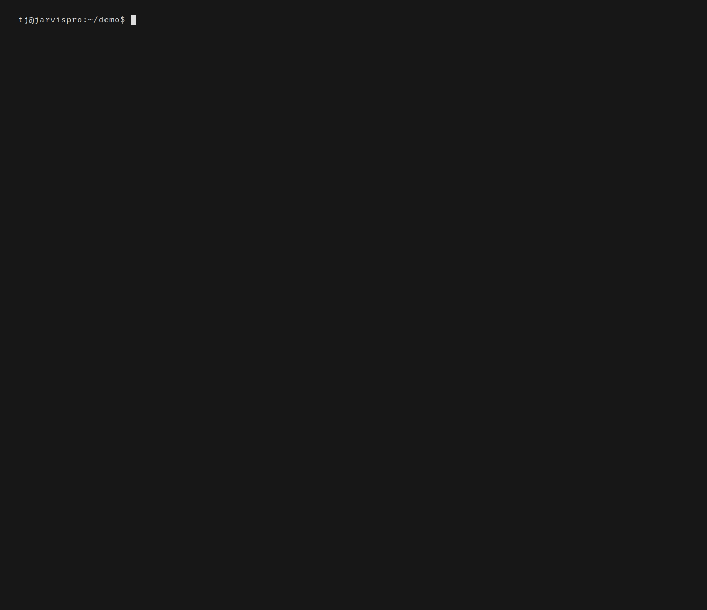

# cfgd-operator

The cluster-side component of cfgd. Watches [Custom Resource Definitions](https://kubernetes.io/docs/concepts/extend-kubernetes/api-extension/custom-resources/) (CRDs) for machine configuration, runs an [admission webhook](https://kubernetes.io/docs/reference/access-authn-authz/extensible-admission-controllers/) to validate specs before they're persisted, and optionally serves a device gateway for enrollment and checkin.

No [Crossplane](https://www.crossplane.io/) dependency: CRDs can be managed by any GitOps tool (ArgoCD, Flux, Helm, or plain `kubectl apply`). For team config distribution via Crossplane, see [team-config.md](team-config.md).

## CRDs

API group: `cfgd.io/v1alpha1`

| CRD | Scope | Spec Reference | Description |
|---|---|---|---|
| `MachineConfig` | Namespaced | [spec](spec/machineconfig.md) | Desired machine state — hostname, profile, packages, files, module refs |
| `ConfigPolicy` | Namespaced | [spec](spec/configpolicy.md) | Team-level policy mandates — required packages, modules, settings |
| `ClusterConfigPolicy` | Cluster | [spec](spec/clusterconfigpolicy.md) | Cluster-wide mandates across selected namespaces, plus module-provenance policy |
| `DriftAlert` | Namespaced | [spec](spec/driftalert.md) | Drifted system settings reported by devices — severity, expected vs actual |
| `Module` | Cluster | [spec](spec/module.md) | Reusable configuration bundle — packages, files, env, scripts; OCI-distributable |

### Installing the CRDs

The Helm chart installs the CRDs automatically:

```sh
helm install cfgd oci://ghcr.io/tj-smith47/charts/cfgd
```

To register the CRDs without Helm (ArgoCD/Flux, a bare `kubectl`, or CI), apply
the single-file bundle published with each release:

```sh
kubectl apply -f https://github.com/tj-smith47/cfgd/releases/latest/download/cfgd-crds.yaml
```

Pin a specific version by swapping `latest/download` for `download/v<VERSION>`.
The bundle is generated from the CRD spec types and is byte-identical to the
CRDs the Helm chart and the OLM bundle install.

### MachineConfig

Represents the desired state of a specific machine. Can be created by any GitOps tool, or generated by Crossplane TeamConfig (see [team-config.md](team-config.md)).

```yaml
apiVersion: cfgd.io/v1alpha1
kind: MachineConfig
metadata:
  name: dev-workstation-jdoe
  namespace: teams
spec:
  hostname: jdoe-macbook
  profile: work-mac
  moduleRefs:
    - name: corp-vpn
      required: true
    - name: corp-certs
      required: true
  packages:
    - name: git-secrets
      version: "1.3.0"
    - name: pre-commit
  files:
    - path: ~/.config/company/security-policy.yaml
      source: security-policy.yaml
      mode: "0644"
  systemSettings:
    shell: /bin/zsh
```

#### MachineConfig Fields

| Field | Type | Description |
|---|---|---|
| `hostname` | string | Machine hostname |
| `profile` | string | Active profile name |
| `moduleRefs` | list | Module references with `name` and `required` flag |
| `packages` | list | Required packages — each entry an object with `name` and optional `version` constraint |
| `files` | list | File specs with `path`, optional `content`, `source`, and `mode` (default `0644`) |
| `systemSettings` | map | System configurator settings |

> `status.packageVersions` (reported installed versions, keyed by package name) is written by the operator, not set in `spec`.

### ConfigPolicy

Team-level policy enforcement. The operator validates MachineConfigs in the same namespace against applicable ConfigPolicies.

```yaml
apiVersion: cfgd.io/v1alpha1
kind: ConfigPolicy
metadata:
  name: backend-policy
  namespace: backend-team
spec:
  requiredModules:
    - name: corp-vpn
      required: true
    - name: corp-certs
      required: true
  packages:
    - name: git-secrets
      version: ">=1.3.0"
    - name: pre-commit
  settings:
    shell: /bin/zsh
  targetSelector:
    matchLabels:
      cfgd.io/team: backend
```

#### ConfigPolicy Fields

| Field | Type | Description |
|---|---|---|
| `requiredModules` | list of ModuleRef | Modules that all matching MachineConfigs must reference (each with `name` and optional `required` flag) |
| `packages` | list of PackageRef | Required packages (each with `name` and optional `version` constraint) |
| `settings` | map | Required system settings |
| `targetSelector` | LabelSelector | Label selector (`matchLabels` / `matchExpressions`) — policy applies to MachineConfigs with matching labels |

### ClusterConfigPolicy

The cluster-scoped sibling of `ConfigPolicy`. It selects whole namespaces (via `namespaceSelector`, not a per-MachineConfig label selector) and adds a cluster-wide `security` block governing module provenance. On conflicts with a namespaced `ConfigPolicy`, the cluster policy wins; see [multi-tenancy.md](multi-tenancy.md#policy-merge-semantics). Full field reference: [spec/clusterconfigpolicy.md](spec/clusterconfigpolicy.md).

```yaml
apiVersion: cfgd.io/v1alpha1
kind: ClusterConfigPolicy
metadata:
  name: org-baseline
spec:
  namespaceSelector:
    matchLabels:
      cfgd.io/managed: "true"
  requiredModules:
    - name: security-tools
      required: true
  security:
    trustedRegistries:
      - ghcr.io/acme-corp
    allowUnsigned: false
```

### DriftAlert

Created by the gateway when a device reports drifted **system settings** during check-in. A
device's report covers the answers of its system configurators alone: packages, managed files,
env vars and aliases are checked on the device by `cfgd diff` and reach the fleet only as the
aggregate counts of a compliance summary, never as findings.

```yaml
apiVersion: cfgd.io/v1alpha1
kind: DriftAlert
metadata:
  name: drift-jdoe-corp-vpn
  namespace: teams
spec:
  deviceId: "abc123"
  machineConfigRef:
    name: dev-workstation-jdoe
    namespace: teams
  severity: High
  driftDetails:
    - field: sysctl.net.ipv4.ip_forward
      expected: "1"
      actual: "0"
```

## Controllers

The operator runs [kube-rs](https://kube.rs/) controllers that watch and reconcile each CRD type:

- **MachineConfig controller**: validates specs, checks compliance against ConfigPolicy, tracks status conditions
- **ConfigPolicy controller**: evaluates all MachineConfigs matching the target selector, reports compliant/non-compliant counts
- **DriftAlert controller**: tracks acknowledgment and resolution state

## Admission Webhook

Validates CRD specs on create/update. Catches invalid configurations (missing required fields, malformed selectors) before they're persisted to etcd.

## Pod Module Injection

A module published as an OCI artifact can be mounted into a pod. A pod asks for it with one annotation. The mutating webhook rewrites the pod on admission, and the CSI node plugin pulls the artifact and bind-mounts it read-only before the container starts.


*Pushing a module, registering it as a `Module`, and reading it back from inside a pod that only asked for it by name.*

Three pieces have to be enabled in the chart:

```yaml
operator:
  enabled: true
csiDriver:
  enabled: true
mutatingWebhook:
  enabled: true
  failurePolicy: Fail   # default is Ignore, which skips injection silently
```

Publish the module, then register it:

```sh
cfgd module push ./tools --artifact ghcr.io/acme/tools:v1
```

```yaml
apiVersion: cfgd.io/v1alpha1
kind: Module
metadata:
  name: tools
spec:
  ociArtifact: "ghcr.io/acme/tools:v1"
  mountPolicy: Always
```

`Module` is cluster-scoped, so one registration serves every namespace. `mountPolicy: Always` mounts the module into every declared container. `mountPolicy: Debug` stages the volume on the pod without mounting it, so only an ephemeral debug container sees it.

Injection is opt-in per namespace, then per pod:

```sh
kubectl label namespace demo cfgd.io/inject-modules=true
```

```yaml
apiVersion: v1
kind: Pod
metadata:
  name: demo-pod
  annotations:
    cfgd.io/modules: "tools:v1"
spec:
  containers:
    - name: app
      image: busybox:1.36
      command: ["sleep", "3600"]
```

The annotation takes a comma-separated list of `name:version` entries. Each one lands at `/cfgd-modules/<module>`, read-only:

```sh
kubectl exec demo-pod -- sh /cfgd-modules/tools/bin/hello.sh
```

A `ConfigPolicy` or `ClusterConfigPolicy` can add modules the pod never asked for, through `requiredModules` (mounted) and `debugModules` (staged only). Label a pod `cfgd.io/skip-injection` to exempt it.

Two settings matter in production:

- `CFGD_CSI_ALLOWED_REGISTRIES` on the CSI driver restricts which registries a pod's `ociRef` may pull from. Unset means any registry is accepted, which the driver warns about at startup.
- `spec.security` on a `ClusterConfigPolicy` gates which modules may be admitted at all. `trustedRegistries` is a list of registry prefixes (a trailing `*` or `/` widens the match), and `allowUnsigned` decides whether a `Module` may carry an `ociArtifact` whose signature does not verify. Both default to the strict answer: `allowUnsigned` is `false`, so creating any `ClusterConfigPolicy` at all starts rejecting every module whose `SIGNATURE` is not `verified` — including one whose signature could not be checked, since a check that never ran is not evidence of a signature. A cluster with no `ClusterConfigPolicy` enforces neither. See [OCI Artifact Signing](modules.md#oci-artifact-signing-cosign).

The operator checks each `Module`'s artifact against the key its `spec.signature.cosign` block declares, by running `cosign verify` against the artifact's own registry. `kubectl get modules` reports what that check concluded in the `SIGNATURE` column, as one of four words:

| Verdict | Meaning |
|---|---|
| `verified` | cosign checked the artifact against the declared key and accepted it |
| `unverified` | cosign checked the artifact and rejected it: no signature, or none the key accepts |
| `unsigned` | the module declares no signature, so there is nothing to check |
| `unknown` | the check could not run at all: no cosign in the operator image, an unreachable registry, a module with no artifact to check, or a `Module` the operator has not reconciled yet |
The `AVAILABLE` column is the `Available` condition: `True` when the operator serves the module, `False` when it withholds it (an unresolvable artifact, or a verdict a `ClusterConfigPolicy` with `allowUnsigned: false` refuses). Every cfgd kind exposes its readiness condition this way (`RECONCILED` on a `MachineConfig`, `ENFORCED` on a policy, `RESOLVED` on a `DriftAlert`), so `kubectl get` answers "is this being served" without a `describe`.


`unknown` is not a verdict about the signature, and the `Verified` condition carries it as `status: Unknown` with the reason on the condition's message:

```sh
kubectl get module tools -o jsonpath='{.status.conditions[?(@.type=="Verified")].message}'
```

The operator reaches the registry itself, so it needs the same registry configuration as the CSI driver: set `operator.extraEnv` (see the [chart README](../chart/cfgd/README.md#registry-settings)) with `OCI_INSECURE_REGISTRIES` for a registry served over plain HTTP. Without it the signature reads `unknown` and the `PLATFORMS` column stays blank.

`kubectl cfgd status` names the context and namespace it read, lists the registered modules with the same verdict vocabulary, and lists the pods in that namespace whose `cfgd.io/modules` annotation asks for modules:

```
Status
  Context    kind-cfgd
  Namespace  demo

Modules
  nettools     ghcr.io/cfgd/nettools:1.0.0 (verified)
  debug-utils  ghcr.io/cfgd/debug-utils:2.0.0 (unsigned)

Pods
  app  nettools:1.0.0, debug-utils:2.0.0
```

Modules are cluster-scoped, so every one is listed. Pods come from a single namespace: the one `--namespace` names, else the kubeconfig current context's, else `default`.

### Debug Containers

`mountPolicy: Debug` stages a module's volume on every pod that asks for it and mounts it into none of that pod's own containers. `kubectl cfgd debug` adds an ephemeral container to a pod that is already running, mounts the staged module into it, and puts the module's `bin` directory on that container's `PATH`.

```sh
kubectl cfgd debug app --module nettools:v1 --image busybox:1.36 --namespace demo
kubectl attach -n demo app -c cfgd-debug -it
```

The debug shell's prompt names the modules mounted into it (`[cfgd:nettools:v1] / $`), so a terminal holding several attached shells says which one is being typed into.


*A pod that cannot see the module, a debug shell that can, and the boundary still holding once that shell exits.*

An omitted `--namespace` resolves the same way `kubectl` itself does: from the kubeconfig current context, falling back to `default` only when the context names none.

## Device Gateway

Optional component, toggled via Helm values (`deviceGateway.enabled: true`). Provides the bridge between the cluster control plane and managed devices.

### Standalone (off-cluster) mode

Set `DEVICE_GATEWAY_STANDALONE=true` to run the operator as a device gateway with no Kubernetes client. The gateway serves the checkin, enrollment, and fleet APIs while controllers, the admission webhook, and leader election are all disabled (each requires a cluster connection). This is the off-cluster CLI fleet path, where the gateway is the only component that needs to run.

```sh
DEVICE_GATEWAY_STANDALONE=true \
DEVICE_GATEWAY_PORT=8080 \
CFGD_SERVER_DB_PATH=/data/cfgd-gateway.db \
  cfgd-operator
```

`DEVICE_GATEWAY_STANDALONE` implies the gateway is enabled; there is no need to also set `DEVICE_GATEWAY_ENABLED`. Standalone is an explicit opt-in: there is intentionally no silent fallback to it when a cluster connection fails, so a real cluster outage in the normal path surfaces as an error rather than being masked.

### Checkin API

A check-in carries the device identity (id, hostname, OS, arch) and the hash of its
desired system configuration. `cfgd checkin` adds a compliance summary when
[`spec.compliance`](spec/config.md#speccompliance) is enabled, and posts any drifted **system
settings** it finds to `/api/v1/devices/{id}/drift`. The daemon's own periodic check-in sends
the identity and hash only.

```sh
cfgd checkin --server-url https://cfgd.acme.com --api-key <key>
```

### Device Config Delivery

An admin (or the cluster operator) pushes desired configuration to a device via the gateway:

```sh
POST /api/v1/devices/{id}/config
```

Every accepted push, even one whose `configHash` is unchanged, advances the device's `generation` counter and records `lastPushedAt`, so operators can confirm that a push was received and processed without waiting for a checkin cycle:

```json
{
  "id": "abc123",
  "hostname": "jdoe-macbook",
  "configHash": "sha256:...",
  "generation": 5,
  "lastPushedAt": "2026-06-10T14:32:00Z"
}
```

The gateway enforces a 10 MiB config-size limit. A config that exceeds it is rejected with `400` and an actionable message (`"config exceeds 10MB size limit"`), not a generic `413 Payload Too Large`. A `413` indicates the request body itself, envelope overhead included, exceeded the 12 MiB transport backstop: a misconfigured client, not an oversized config.

### Enrollment

Two methods for registering new devices:

**Bootstrap Token** (default, `CFGD_ENROLLMENT_METHOD=token`):
Modeled after [kubelet TLS bootstrapping](https://kubernetes.io/docs/reference/access-authn-authz/kubelet-tls-bootstrapping/). An admin generates a short-lived token, gives it to the user, and the user's device exchanges it for a permanent API key.

1. Admin generates token via `POST /api/v1/admin/tokens`
2. User runs `cfgd enroll --server-url <url> --token <token>`
3. Device authenticates, registers, receives permanent API key

**SSH/GPG Key Verification** (`CFGD_ENROLLMENT_METHOD=key`):
Challenge-response enrollment using pre-registered public keys. The device signs a server-issued nonce to prove identity.

1. Admin registers user's public key via `POST /api/v1/admin/users/{username}/keys`
2. User runs `cfgd enroll --server-url <url>`
3. Server issues nonce, client signs it, server verifies against stored keys

Key verification runs `ssh-keygen -Y verify` (SSH) and `gpg --verify` (GPG) as subprocesses on the server, so `openssh-client` and `gnupg` must be present in the gateway's environment. The published `cfgd-operator` image bundles both; a custom image or bare-metal deployment serving key enrollment must install them.

```sh
cfgd enroll --server-url https://cfgd.acme.com --token <bootstrap-token>
cfgd enroll --server-url https://cfgd.acme.com
cfgd enroll --server-url https://cfgd.acme.com --ssh-key ~/.ssh/id_ed25519
cfgd enroll --server-url https://cfgd.acme.com --gpg-key ABCD1234
```

### Web Dashboard

Device inventory, reported system-settings drift, and compliance posture at a glance. The
`Drifted` count is devices whose last report named a drifted system setting — a drifted package
or file is never reported as a finding, so `Healthy` means "nothing reported", not "verified in
sync".

### SSE Streaming

Real-time event feed at `/api/v1/events/stream` for monitoring integrations.

## Binary CLI

The `cfgd-operator` binary answers `--version` and `--help` instantly, rejects unknown arguments with a non-zero exit, and starts the serving loop only when invoked with no arguments:

```sh
cfgd-operator --version   # print version and exit 0
cfgd-operator --help      # print usage and exit 0
cfgd-operator             # run the operator / gateway (no-arg invocation)
cfgd-operator --unknown   # exit non-zero immediately (no hang)
```

All runtime configuration is via environment variables (`DEVICE_GATEWAY_*`, `WEBHOOK_CERT_DIR`, ...); there are no serving-mode flags.

## DaemonSet Mode

The same `cfgd daemon` binary can be deployed as a Kubernetes [DaemonSet](https://kubernetes.io/docs/concepts/workloads/controllers/daemonset/) (a pod that runs on every node in the cluster). Config is mounted via ConfigMap. Profiles target node-level [system configurators](system-configurators.md):

- `sysctl`: kernel parameters
- `kernelModules`: br_netfilter, overlay, ip_vs
- `containerd`: container runtime config
- `kubelet`: kubelet configuration
- `apparmor`: security profiles
- `seccomp`: syscall filtering
- `certificates`: X.509 cert management

Reports status to the device gateway via checkin API. Managed by the cluster, not by systemd/launchd.

## Helm Chart

One chart at `chart/cfgd/` ships the operator, the agent DaemonSet and the CSI driver. Components are toggled via values:

```yaml
operator:
  enabled: true
webhook:
  enabled: true
csiDriver:
  enabled: false
agent:
  enabled: false
deviceGateway:
  enabled: false
```

Install:

```sh
helm install cfgd ./chart/cfgd \
  --set deviceGateway.enabled=true
```

See the [chart README](../chart/cfgd/README.md) for the full values reference.
