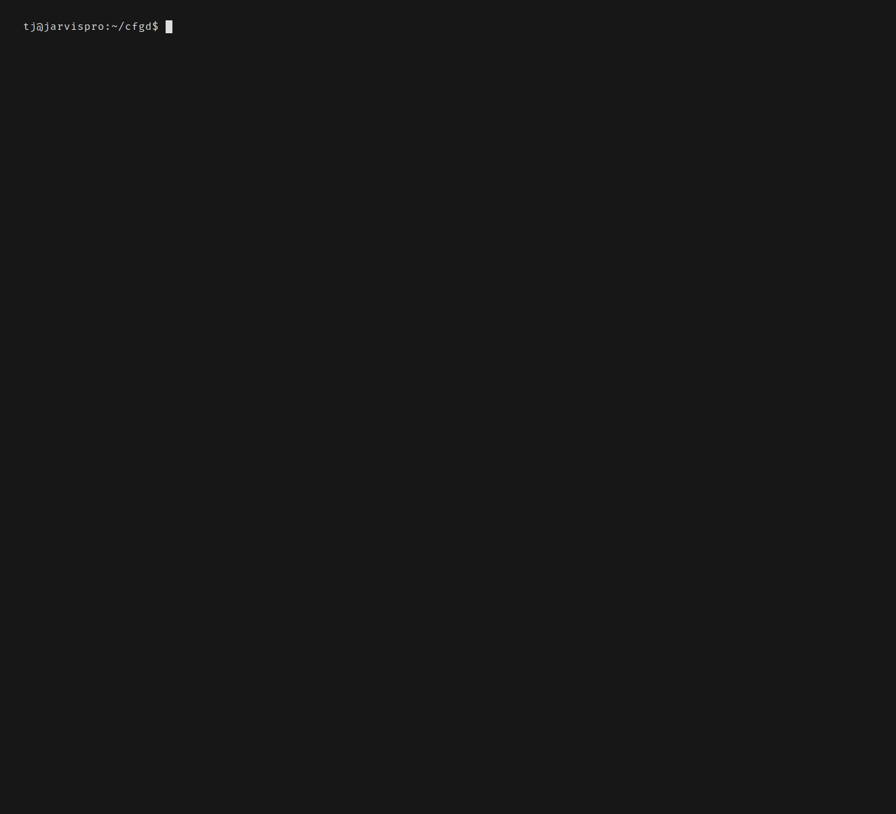

# Multi-Source Config Management

cfgd supports subscribing to multiple config sources (team baselines, security policies, org-wide standards) alongside your personal config. Sources are composed with policy tiers that control what you can and can't override.

This is different from [module registries](modules.md#module-registries), which are plain collections of reusable modules. Sources provide complete profiles with **policy enforcement**: a team can require certain packages, lock certain files, and recommend others, with cfgd enforcing those policies on every reconcile. For the source subscription field reference, see the [Config spec reference](spec/config.md#specsources).

## Conceptual Model

| Concept | Description |
|---|---|
| **ConfigSource** | Team publishes a config source: profiles, modules, packages, files, with a policy manifest |
| **ConfigSubscription** | Developer subscribes to a source in their `cfgd.yaml` |
| **Composition** | Merge engine combines all sources with priority and policy enforcement |

## ConfigSource Manifest

Published by the team as `cfgd-source.yaml` at the root of their config repo. A source must provide at least one **profile** or at least one **module** in `spec.provides`; a manifest with neither is rejected as invalid.

A source delivers only:
- **Profiles**: complete profile specs (`spec.provides.profiles` / `spec.provides.platformProfiles`)
- **Policy tiers**: required, recommended, optional, locked items and constraints (`spec.policy`)
- **Module bodies**: module implementations listed in `spec.provides.modules` (a "module library" source)

Consumer-local top-level config sections (`theme`, `ai`, `daemon`, `fileStrategy`, `compliance`) are **never** source-delivered. They are always local-only and ignored if present in a source's profile.

```yaml
apiVersion: cfgd.io/v1alpha1
kind: ConfigSource
metadata:
  name: acme-corp-dev
  version: "2.1.0"
  description: "ACME Corp developer environment baseline"
spec:
  provides:
    profiles:
      - acme-base
      - acme-backend
      - acme-frontend
    platformProfiles:
      macos: acme-base
      debian: acme-backend
      ubuntu: acme-backend
      fedora: acme-frontend
      linux: acme-base
    modules: [corp-vpn, corp-certs, approved-editor]

  policy:
    required:
      packages:
        brew:
          formulae: [git-secrets, pre-commit, aws-cli]
      files:
        - source: "linting/.eslintrc.json"
          target: "~/.eslintrc.json"
      modules: [corp-vpn, corp-certs]
    recommended:
      packages:
        brew:
          formulae: [k9s, stern, kubectx]
      modules: [approved-editor]
    optional:
      profiles: [acme-sre]
    locked:
      files:
        - source: "security/security-policy.yaml"
          target: "~/.config/company/security-policy.yaml"

    constraints:
      noScripts: true
      noSecretsRead: true
      allowedTargetPaths:
        - "~/.config/acme/"
        - "~/.config/company/"
```

## Subscribing

In your `cfgd.yaml`:

```yaml
spec:
  sources:
    - name: acme-corp
      origin:
        type: Git
        url: git@github.com:acme-corp/dev-config.git
        branch: master
      subscription:
        profile: acme-backend
        priority: 500
        acceptRecommended: true
        overrides:
          env:
            EDITOR: nvim
          packages:
            npm:
              global: [prettier]
        reject:
          packages:
            brew:
              formulae: [kubectx]
      sync:
        interval: "1h"
        autoApply: false
        pinVersion: "~2"
        required: false      # best-effort: a load failure warns and skips this source
```

## Adopting a team base profile

The **active profile is always local**. A source-delivered profile is a remote
building block that a local profile *pulls in* via `subscription.profile`; it
can never be `spec.profile` directly. This keeps composition strict: a machine's
active configuration lives in its own repo, and source profiles layer underneath
it by priority.

So to adopt a team's `acme-backend` profile, subscribe a local profile to it
rather than naming it as the active profile:

```yaml
spec:
  profile: workstation          # local: your machine's active profile
  sources:
    - name: acme-corp
      origin:
        type: Git
        url: git@github.com:acme-corp/dev-config.git
      subscription:
        profile: acme-backend   # the team profile, pulled in under `workstation`
        priority: 500
```

If you point `spec.profile` (or `--profile`) at a name that only a subscribed
source provides, cfgd names the source that offers it and prints the exact
`subscription` snippet to wire it in, then reminds you to set `spec.profile` to
a local profile. (A plain typo that no source provides still gets the bare
not-found.)

## Platform-Aware Profile Auto-Selection

Cross-platform sources (e.g., a team config with separate macOS/Ubuntu/Fedora profiles) can declare a `platformProfiles` map in their manifest. When a subscriber runs `cfgd source add` without `--profile`, cfgd detects the local platform and selects the matching profile automatically.

```yaml
spec:
  provides:
    profiles: [linux-debian, linux-fedora, macos-arm]
    platformProfiles:
      debian: linux-debian
      fedora: linux-fedora
      macos: macos-arm
      linux: linux-debian
```

Keys are platform identifiers: either a Linux distro ID (from `/etc/os-release`, e.g., `debian`, `ubuntu`, `fedora`, `arch`) or an OS name (`macos`, `linux`, `windows`). Values are profile names that must appear in `profiles` or `profileDetails`.

Matching order:
1. **Exact distro match**: if the machine is Debian, look for a `debian` key
2. **OS fallback**: if no distro key matches, look for a `linux` / `macos` key
3. **No match**: fall through to single-profile auto-select or interactive prompt

When auto-selection succeeds, cfgd prints the selected profile and platform. You can always override with `--profile`:

```sh
cfgd source add git@github.com:acme-corp/dev-config.git --profile linux-fedora
```

## Policy Tiers

Sources use four tiers to control what subscribers can and can't change. The key difference between **locked** and **required** is granularity: locked items can't be touched at all (not even adding alongside), while required items must be present but you can add your own on top.

| Tier | What it means | Example |
|---|---|---|
| **Locked** | Subscriber cannot override, modify, or remove. The source has absolute control. | A security policy file that must be byte-for-byte what the team published |
| **Required** | Must be present, but subscriber can add alongside. | `git-secrets` must be installed, but you can also install your own tools |
| **Recommended** | Applied only when the subscriber sets `acceptRecommended: true`; individual items can still be rejected. | Team suggests k9s, but you prefer a different k8s dashboard |
| **Optional** | Subscriber must explicitly opt in. | An SRE-specific profile most developers don't need |

Local config is always priority 1000. Team sources default to 500. Higher priority wins on conflict.

## Composition Algorithm

When you subscribe to multiple sources, cfgd merges them with your local config. Here's a concrete example:

```
Your machine subscribes to:
  acme-base     (priority 400)  requires git-secrets
  acme-backend  (priority 500)  recommends env EDITOR="code"
  local config  (priority 1000) sets env EDITOR="nvim"

Result:
  git-secrets   installed (required by acme-base, can't override)
  EDITOR="nvim" your local env override wins (1000 > 500)
```

The full algorithm for each resource:
1. Collect all declarations from all sources + local
2. If only one source: use it
3. If multiple sources:
   - **Locked**: source wins unconditionally
   - **Required**: packages union; for files/env/system the source wins
   - **Recommended + `acceptRecommended: true` + not rejected**: source value as default, local override wins
   - **Recommended + `acceptRecommended: false` (default)**: skip entirely unless individually accepted
   - **Recommended + rejected**: skip entirely
   - **Subscriber `overrides`**: applied immediately above the source's own recommended/standard items but below its required/locked tiers. An override rides at its own source's rank, so it refines only that source: local config (1000) and any higher-priority sibling source still win over it. To override across sources, raise this source's priority or set the value in your local config. Scalar fields (env, aliases, system, files) replace the source's value by name; list fields (packages, modules) are added (union), not replaced.
   - **Multiple non-local sources conflict**: higher priority wins; equal priority falls back to alphabetical source name

A source's profile can also deliver `spec.backups[]` (see [Declarative Backups](backups.md)). Backups merge by **append, deduplicated by `name`**, the same rule profile inheritance uses: a higher-priority layer redeclaring a name replaces that entry wholesale, and any name only one layer declares survives. Their `preBackup`/`postBackup` hooks are governed by [`noScripts`](#noscripts) and their `destination` by [`allowedTargetPaths`](#allowedtargetpaths).

## CLI Commands

Connect to a team's config source. cfgd fetches the manifest, shows available profiles and the policy breakdown, and walks you through subscribing:

```sh
cfgd source add git@github.com:acme-corp/dev-config.git
```

### Naming a Source

`cfgd source add` (and `cfgd source replace`) takes any git URL or the GitHub shorthand
`owner/repo`. The shorthand is a convenience for GitHub, never a requirement; every other
value reaches git exactly as you wrote it:

```sh
# GitHub shorthand: expands to https://github.com/acme-corp/dev-config.git
cfgd source add acme-corp/dev-config

# Any git URL, on any host
cfgd source add https://github.com/acme-corp/dev-config.git
cfgd source add https://gitlab.example.com/acme-corp/dev-config.git
cfgd source add git@git.example.com:acme-corp/dev-config.git
cfgd source add ssh://git@codeberg.org/acme-corp/dev-config.git
```

Only a bare `owner/repo` is expanded, and three shapes are never mistaken for a shorthand:

- An **existing local path** wins: run inside a directory holding `acme-corp/dev-config`
  and that is what the value means (it is then refused as an origin, see below, rather
  than quietly subscribing you to a stranger's same-named GitHub repository).
- A **dotted first segment** (`gitlab.example.com/acme-corp/dev-config`) is a URL for
  that host, not a GitHub owner, and passes through untouched.
- A **dotless host** (`gitserver/dev-config`) cannot be told from an owner by the value
  alone, so name it with a scheme (`http://gitserver/dev-config`).

The inferred source name is the same either way (`dev-config`), so a shorthand and its
full URL always name one subscription.

A source origin must be a **remote**. Local paths (absolute, relative, and `file://`)
are refused: a source delivers files, packages and scripts to this machine, so its origin
has to be something a subscriber can fetch, pin and verify, not a directory anything on
the host can rewrite. See [testing a source locally](#testing-a-source-locally) for the
development workflow.

Manage existing subscriptions:

```sh
cfgd source list                                        # list subscribed sources
cfgd source show acme-corp                              # details, policies, conflicts
cfgd source remove acme-corp                            # unsubscribe
cfgd source update                                      # fetch latest from all sources
```

`cfgd source list` shows the two facts that change between one listing and the next
alongside the subscription's own columns:

```
Sources
Name       Source                                   Priority  Status  Last Sync  Signed
───────────────────────────────────────────────────────────────────────────────────────
acme-corp  https://github.com/acme-corp/dev-config  500       Active  2h ago     yes
```

`Last Sync` is the age of the last successful fetch (`never` before the first one) and
`Signed` whether that commit carried a verified signature (`-` when nothing is recorded
yet). `-o json` keeps the exact ISO 8601 instant; `--wide` adds the source's
self-reported `Version`.

### What a source provides

`cfgd source add` renders the source's manifest before it asks you to confirm, and
`cfgd source show` renders the same block afterwards. Both go through one composer, so a
subscription decision and a later inspection describe the source identically:

```
Manifest
  Name         acme-corp
  Version      1.0.0
  Description  Team-wide baseline

Profiles
  profile:default
    Env
      EDITOR  vim
    Packages
      brew formulae  ripgrep

Policy
  Require Signed Commits  false
  Scripts Allowed         false
  Secrets Read Allowed    false
  System Changes Allowed  false
  Allowed Target Paths    ~/.config/**, ~/.bashrc
  Required
    ◉ file: ~/.bashrc
  Recommended
    ◉ system: shellAliases
```

Each provided profile is headed by the `profile:<name>` token an apply header uses, and
its contents are the same inventory `cfgd profile show` renders. Env values are shown in
full (secrets stay `${secret:...}` references), so you see what a subscription would put
in your environment before you take it. A profile the manifest promises but the checkout
does not carry is reported under its own token rather than rendered empty.

The `Policy` rows read in one polarity (`Scripts Allowed  false`, never a mix of
"allowed" and "blocked" phrasings). On `source show` they are the *effective* policy,
folding in your own subscription's `allowScripts` / `requireSignedCommits`; on
`source add` they are the policy the pending subscription would take. `Locked`,
`Required` and `Recommended` list their items directly, with no separate count row.

Both surfaces carry the same data under `-o json`, in an additive `manifest` object:

```console
$ cfgd source show acme-corp -o json | jq '.manifest'
{
  "name": "acme-corp",
  "version": "1.0.0",
  "description": "Team-wide baseline",
  "profiles": [{ "name": "default" }],
  "modules": ["dev-tools"]
}
```

Override or reject a source's recommendation (e.g., "I don't want kubectx, and I prefer nvim over VS Code"):

```sh
cfgd source override acme-corp reject packages.brew.formulae kubectx
cfgd source override acme-corp set env.EDITOR "nvim"
```

Change how conflicts resolve (higher priority means this source's items win over lower-priority sources):

```sh
cfgd source priority acme-corp 800
```

Switch teams or replace a source entirely:

```sh
cfgd source replace acme-corp newco/dev-config                   # GitHub shorthand
cfgd source replace acme-corp git@github.com:newco/dev-config.git
cfgd source replace acme-corp https://gitlab.example.com/newco/dev-config.git
```

Publish your own source:

```sh
cfgd source create my-team                      # create a cfgd-source.yaml
cfgd source edit                                # open cfgd-source.yaml in $EDITOR
```

## Automatic Apply Decisions

Two different fields spell `autoApply`, and they answer different questions. `spec.daemon.reconcile.autoApply` (this section) is the decision flow's switch: with it on, every incoming source item is classified against the policy tiers below and withheld until answered. `spec.sources[].sync.autoApply` (the per-source flag `cfgd source add --auto-apply` sets) answers a different one: after a refresh that actually changed that source, the daemon reconciles the whole profile immediately and applies, forcing `Auto` for that tick regardless of `spec.daemon.reconcile.driftPolicy`. It classifies nothing, so the decision gate is unaffected: an item awaiting a decision is withheld from that apply exactly as it would be from any other.

When the daemon detects new items from a source update, behavior depends on the daemon policy:

```yaml
daemon:
  reconcile:
    autoApply: true
    policy:
      newRecommended: Notify    # Notify | Accept | Reject
      newOptional: Ignore       # Notify | Ignore
      lockedConflict: Notify    # Notify | Accept
```

- `Notify`: record a pending decision, send a notification, don't apply. Whichever run classifies the item first records it (the daemon's tick, or a `cfgd apply` that reaches it first), so the item is withheld from the very first plan that sees it and is answerable with `cfgd decide` straight away.
  - `cfgd apply` records only once you let the run proceed (`--yes`, or answering the prompt); declining the confirmation declines its writes too, so the daemon's later notification is preserved. An apply with nothing else to do still proceeds and still records the items its header named.
  - `cfgd plan` writes nothing: it lists the item as pending without recording it and leaves the row to the apply that follows.
  - `cfgd decide` can answer an item nothing has recorded yet: it records and resolves in one step, touching only the items you named, so the daemon's notification for the source's other new items is preserved.
  - The desktop notification is the daemon's; an apply shows you the same item on screen instead.
- `Accept`: automatically apply without prompting
- `Reject`/`Ignore`: skip silently. The item is withheld from the plan and no decision row is recorded, because a rejecting policy is a standing answer rather than a question for you. `cfgd plan` and `cfgd apply` withhold it exactly as the daemon does, so a manual apply cannot install what the policy declines. Re-run with `Notify` if you want to be asked: cfgd asks about anything it has never asked about, so the switch takes effect on the next run without waiting for the source to change.

Resolve pending decisions with `cfgd decide`:

```sh
cfgd decide accept packages.brew.k9s
cfgd decide reject packages.brew.stern
cfgd decide accept --source acme-corp     # accept all from source
cfgd decide accept --all                  # accept everything
```

### How New Items Are Detected

The daemon tracks a hash of each source's merged config. When a source update changes the hash, cfgd diffs the previous merge result against the new one. Any resource present in the new result but absent in the old (or moved to a different policy tier) is treated as a "new item" that needs a decision.

Pending decisions have three states:

| State | Meaning |
|---|---|
| **Pending** | New item detected, awaiting user action |
| **Accepted** | User approved; item included in next reconcile. A row resolved because the package was already installed carries resolution `auto-accepted` instead of `accepted`, so you can tell installed-state answers from your own |
| **Rejected** | User declined; item excluded from reconciliation |

Only **Accepted** puts the item on your machine. `cfgd plan`, `cfgd apply` and the daemon all read the same decisions and withhold the resource identically: a Pending or Rejected item is absent from the plan preview, from the action counts, and from the `-o json` payload, and neither `cfgd apply --yes` nor a `cfgd apply` you confirm at the prompt will install it. Both states are named on the surface you read: **Pending Decisions** lists the items awaiting you and **Declined Decisions** the ones you already answered (`-o json` carries them as `pendingDecisions` and `rejectedDecisions`), so an item missing from the plan is always explained by a decision you can see:

```sh
$ cfgd plan
Plan
  Config   /home/you/.config/cfgd/cfgd.yaml
  Profile  default
  Phases   Prerequisites, Packages

Pending Decisions (not included in this plan)
  source:acme-corp
    ◉ Recommended packages.brew.k9s — brew install k9s

Phase: Prerequisites
  cfgd:managers
    - refresh brew index

Phase: Packages
  profile:default
    - brew install ripgrep

◉ 2 actions planned
→ Run `cfgd decide accept <resource>` or `cfgd decide reject <resource>` to answer

$ cfgd decide accept packages.brew.k9s
$ cfgd plan            # k9s now plans alongside ripgrep
◉ 3 actions planned
```

`cfgd decide` is the only way to move an item out of Pending; neither `plan` nor `apply` resolves a decision for you.

A plan whose only remaining work is withheld says so instead of reporting success, so "up to date" never covers an item you have not answered:

```
⊙ Nothing to apply — 1 decision pending
→ Run `cfgd decide accept <resource>` or `cfgd decide reject <resource>` to answer
```

`cfgd apply` closes with the same line.

### Items a Higher Layer Already Wins

An item can be pending and, once accepted, still change nothing: a higher-priority layer already owns that entry. Every surface that lists a decision (`cfgd decide`, `cfgd status`, and the plan/apply header) annotates the row with the owner that wins it:

```
Pending Decisions (1 item)
  source:acme-corp
    ◉ Recommended env.PAGER — PAGER=less (outranked by module:nvim)
```

Read it as "accepting this records your answer, and the apply that follows writes nothing" — the winner may be a higher-priority source, your local config, or a module (module env sits above a profile layer's). Only `env` items carry the annotation: the merge records a per-entry owner for env and nothing else. Packages merge as a union (no entry displaces another), and `files` / `system` entries are keyed by target with the winning value written straight into the merged spec, so there is no losing layer to name.

Notifications fire once per new pending decision, not on every reconcile cycle (an item first recorded by `cfgd apply` is shown to you on screen and does not notify again). If you don't act on a decision, you won't be reminded again until the source publishes an update that changes that item itself (a change to a different item the same source delivers is not a reminder about yours).

### Edge Cases

- **Source removed while decisions pending**: every decision belonging to that source is discarded, resolved ones included (source gone = items gone). Rows are dropped rather than rejected, because a source you no longer subscribe to must not go on withholding a file or package you later declare yourself; a row that outlives the sweep is inert anyway, since only a source listed in `spec.sources` can withhold anything. Re-subscribing asks again. The sweep runs only against the machine's own config: a run pointed at a foreign config (`--config`, `--config-dir`, or `CFGD_CONFIG` resolving away from the default config location for the run's scope) while the state directory stays at its default skips the sweep, because that config's subscription list describes a different machine. Ownership follows the resolved path, not the spelling, so naming the default config file explicitly (as the generated service units do) still sweeps; pass `--state-dir` alongside and any config sweeps the store it names.
- **A decision names something you declare yourself**: a decision covers the *source's* offer of a resource, never your own declaration of it. If you declare `~/.zshrc` in your profile and a source offers a `~/.zshrc` too, declining the source's item leaves yours applying exactly as before. The two need not be spelled alike: `~/.zshrc` and `/home/you/.zshrc` are the same declaration, and a package you declare through a manifest file (`brew.file: Brewfile`, `cargo.file: Cargo.toml`) is as much yours as one you list inline.
- **A source delivers packages under a custom manager whose name contains `.`**: decision paths are dot-notation (`packages.<manager>.<package>`), so a manager named `pip3.11` cannot round-trip into one and no decision row can ever be recorded for its items. cfgd fails closed rather than installing undecided: the source's packages under that manager are withheld from every run (plan, apply, and the daemon alike), and the run carries a warning naming the manager and the limitation, in the human header and in the `-o json` payload's `warnings`. `cfgd status` and the bare `cfgd decide` listing carry the same warning. Your own declarations under the same manager still apply. Rename the manager (e.g. `pip311`) to be asked about its items normally.
- **User manually installs a pending package**: the next run that plans packages (plan, apply, or a daemon tick) finds it in the enumeration the planner diffs against and auto-accepts the decision, **but only when the installed state satisfies the source's version spec**.
  - An item with no version spec is satisfied by any installed version (the common case). A spec announces itself with a range operator or a `v`-prefixed version (`tool@^14`, `tool@>=2.1`, `tool@v1.2.3`). A bare `v`-pin keeps semver caret semantics (`tool@v1.2.3` means `^1.2.3`, matching cargo/npm convention). Anything else after an `@` is part of the package's *name*: brew's `python@3.12` is a formula, never a `3.12` pin.
  - Satisfaction is judged against the version the manager's own listing reports. `tool@^14` with `14.2` installed auto-accepts, and the plan still converges the pin: accepting is consent to apply, not a skip. A mismatch stays Pending with the conflict annotated on the row (`installed 13.0, source wants ^14`); a manager whose listing reports no version stays Pending the same way (`installed (version unknown), source wants ^14`).
  - Auto-accept is fail-closed and packages-only: an unavailable manager or failed enumeration leaves the item Pending, and a `files.`/`env.`/`system.` item never auto-accepts (an existing file matching source content is not consent).
  - On a writing path the row records resolution `auto-accepted`, distinguishable from an `accepted` you answered by hand. `cfgd plan` previews the item as included without recording anything; the offline dashboards (`status`, bare `decide`) enumerate no package state, so they keep listing the item until a planning run releases it.
  - An item you explicitly rejected is never auto-accepted: your standing answer outranks installed state. A rejection expires only when the item it answered changes (not when some other item in the same source does); the fresh question is then judged like any other, installed state included.
- **Policies only apply when `autoApply` is enabled**: they decide what a *new* item is worth. With `autoApply: false` no policy runs and no decision row is ever created, so every source item applies. With it on, the policy governs every path equally: `cfgd plan` and `cfgd apply` read the same tiers the daemon does, because a standing `Reject` that only the unattended loop honoured would make a manual apply the way around it. Rows already in the store are honoured whatever the mode; turning `autoApply` off does not release an item you left pending. "Equally" covers the default `Notify` tier too: an item nobody has been asked about yet is withheld by `cfgd plan` and `cfgd apply` exactly as one with a pending row is.
- **A config cfgd cannot read decides nothing**: `cfgd apply --module <name>` still runs when `cfgd.yaml` will not parse, but a config it could not read says nothing about which sources you subscribe to. Decisions are neither discarded nor released on that run: every row keeps withholding until a run can read the real subscription list.
- **Rejection doesn't persist across changes to the item**: if you reject an item and the source later changes what that item declares (a different version, a different value, different file content), a fresh pending decision is created. This prevents stale rejections from silently blocking items the team considers important. The unit is the item, not the source: an upstream commit that adds or edits *other* items leaves your answer alone, and an item whose own declaration changed is re-asked even when nothing else in the source moved.

## Source Constraints

Sources declare `constraints` in their manifest to limit what they can do on your machine. cfgd enforces these at composition time, before anything is applied.

### `allowedTargetPaths`

Restricts where a source can write files. Any file target outside the declared paths is rejected during composition with an error:

```yaml
constraints:
  allowedTargetPaths:
    - "~/.config/acme/"
    - "~/.config/company/"
    - "~/.eslintrc*"
```

If the source tries to deploy a file to `~/.bashrc` (not in the allowed list), cfgd rejects that file and reports the violation in `cfgd plan`. The rest of the source's items still apply normally.

Two paths are covered, and one deliberately is not:

| Field | Constrained | Why |
|---|---|---|
| `spec.files.managed[].target` | yes | the file the source writes |
| `spec.backups[].destination` | yes | the directory the source makes cfgd write snapshots into. Omitting it defaults to `<state_dir>/backups/<name>/` — cfgd's own state dir, not a path the source chose — which is always allowed |
| `spec.backups[].source` | **no** | a backup `source` is read, never written. Snapshotting a path the allow-list does not cover (`~/.ssh` before a risky apply) is the feature's primary use, and the snapshot can only ever land inside a `destination`, which *is* constrained. Under `noScripts` the source also cannot run a hook that could move the snapshot elsewhere |

### `noScripts`

When `true` (the default), the source cannot deliver anything that executes code. Every surface is covered, because "a script" is not always spelled `scripts:`:

| Surface | Where it is declared | When it would run | Blocked at |
|---|---|---|---|
| Lifecycle scripts | `spec.scripts.{preApply,postApply,preReconcile,postReconcile,onChange,onDrift}` on the source's profiles and policy tiers | apply / reconcile | composition time |
| Backup hooks | `spec.backups[].preBackup` / `postBackup` | `cfgd apply`, `cfgd backup run`, `cfgd backup restore`, the daemon's timer | composition time |
| Patch filters | `spec.files.managed[].patch.script` (`strategy: Patch`) | every command that evaluates the file — including read-only `cfgd diff` / `status` / `verify` / `compliance` | composition time |
| Module-body scripts | the same lifecycle hooks, `prefer: [script]` package installs, and `spec.files[].patch.script` on any module delivered via `provides.modules` | apply / reconcile / evaluation | module-load time |

How the block shows up depends on whether the command changes the machine:

- **Commands that change the machine** (`apply`, `plan`, `daemon`, `backup run`, `backup restore`, `source add`) abort composition on the first violation and run nothing. The error names the exact surface, e.g. `source 'acme' carries a preBackup hook on backup 'db', but it is not allowed to run scripts`.
- **Read-only commands** (`status`, `diff`, `verify`, `compliance`, `backup list`, `checkin`) still have to describe the machine, so they keep composing and report every violation as a warning instead. The source's contribution stays visible, but a patch filter it is barred from running is marked unrunnable at composition time, so evaluating the file reports a per-file failure naming the source rather than executing the filter:

  ```
  ⚠ source 'acme' violates its constraints — composition error: source 'acme' carries a patch script for ~/.config/acme/app.ini, but it is not allowed to run scripts (set subscription.allowScripts: true to opt in, or relax the source's constraints.noScripts)

  Files

  ⚠ ~/.config/acme/app.ini: cannot evaluate patch spec: file error: patch script for ~/.config/acme/app.ini is blocked: source 'acme' is not allowed to run scripts (constraints.noScripts); set subscription.allowScripts: true to opt in
  ```

  Under `-o json` the same file appears in the payload's `files[]` array with `matches: false` and the block as its `actual`, so the reason survives on the structured path too.

  Lifecycle scripts and backup hooks need no such marking: no read-only command executes one.

  **Carve-out: module bodies.** The read-only path above applies to what the source's *profiles* declare. A source-delivered **module** carrying a script is rejected at module-load time, which is fail-closed in every mode: a read-only command aborts with exit code 4 rather than degrading, e.g. `module error: module 'mymod' delivered by source 'acme' carries a patch script for ~/.config/acme/app.ini, but that source is not allowed to run scripts`. Module delivery is all-or-nothing: there is no partial module to describe.

A `patch.ensure` block is a declarative merge, not code, and is never rejected by `noScripts`.

Subscribers can relax this by setting `allowScripts: true` in their subscription:

```yaml
spec:
  sources:
    - name: acme
      subscription:
        profile: acme-backend
        allowScripts: true   # opt in to this source's scripts
```

The same knob from the CLI:

```sh
cfgd source add acme/config --allow-scripts
cfgd source update acme --allow-scripts
cfgd source update acme --no-allow-scripts
```

With `allowScripts: true`, the source's scripts are permitted and every command that composes sources warns, naming each surface it found, so the execution is visible before any apply. It is a warning rather than a note deliberately: a note renders only under `-v`, which is not where the line announcing that third-party code will run belongs.

```
⚠ source 'acme' scripts will run because allowScripts is set — constraints.noScripts is overridden by your subscription; it carries a preApply script, a preBackup hook on backup 'db', a patch script for ~/.config/acme/app.ini
```

A source that ships no script surface at all prints nothing: there is no risk to disclose.

### `allowSystemChanges`

By default, sources cannot install launch agents, systemd units, or modify shell configuration. A source that attempts to set `shell:` config or deploy a LaunchAgent without `allowSystemChanges: true` in its constraints is rejected. The subscriber must explicitly opt in.

### `noSecretsRead`

When `true`, the source cannot reference or access the subscriber's SOPS/age keys, encrypted files, or secret provider credentials.

## Template Sandboxing

Source templates run in a restricted variable context. A source template can access:

- **Source-provided variables**: env vars declared in the source's own profile
- **System facts**: `__os`, `__arch`, `__hostname`, `__distro` (detected at reconcile time)

Personal env vars from your local profile are **not** available to source templates. This prevents a team source from reading or exfiltrating your personal configuration.

Example of what a source template sees:

```yaml
# Source provides these variables:
env:
  - name: COMPANY_PROXY
    value: "proxy.acme.com:8080"

# Source template (~/.config/acme/proxy.conf):
proxy_host = {{ COMPANY_PROXY }}
platform = {{ __os }}
arch = {{ __arch }}

# These are NOT available in source templates:
# EDITOR, GITHUB_TOKEN, or any variable from your local profile
```

## Composition Priority Details

When multiple sources (and your local config) declare the same resource, priority determines which value wins. Each source has a numeric priority:

| Source Type | Default Priority |
|---|---|
| Local config | 1000 |
| Team sources | 500 |

Higher priority wins. When two sources have equal priority, the source whose name comes first alphabetically wins (deterministic tiebreaker). **Locked items always win regardless of priority**: a locked file at priority 400 overrides a local file at priority 1000.

Here's a concrete three-source conflict:

```
Sources (subscriber has acceptRecommended: true):
  acme-base     (priority 400)  sets EDITOR="nano"      (recommended)
  acme-backend  (priority 500)  sets EDITOR="code"      (recommended)
  local config  (priority 1000) sets EDITOR="nvim"

Resolution for EDITOR:
  acme-base loses to acme-backend (500 > 400)
  acme-backend loses to local (1000 > 500; recommended items can be overridden by local)
  Result: EDITOR="nvim"

Without acceptRecommended: true:
  Both recommended EDITOR values are skipped entirely.
  Result: EDITOR="nvim" (local only)

But if acme-backend had EDITOR as "locked":
  Locked always wins regardless of priority
  Result: EDITOR="code" (local override rejected)
```

## Version Pinning

A source subscribed **without** `pinVersion` is **floating**: it tracks the remote's default-branch HEAD and is not reproducible: any `cfgd source update` may advance it to a different commit. Pin the source to get a reproducible ref.

The `pinVersion` field pins a source to a concrete **git ref**: a tag selected from the source repository's tags, or an exact commit SHA. cfgd resolves the pin against the remote's git tags (via `git ls-remote --tags`), **not** the source's self-reported `metadata.version`. This is more secure: a source cannot bypass your pin by editing the version string in its own `cfgd-source.yaml`. A checked-out pin is always a detached HEAD on the resolved ref.

A `pinVersion` value is interpreted in this order:

1. **Semver range**: list the source's git tags, strip a leading `v`, filter by the range, and check out the **highest** matching tag. It never checks out a tag outside the range. When no tag matches, behaviour depends on whether a previously-resolved checkout exists and whether the source is `required`; see [When a pin stops matching](#when-a-pin-stops-matching) below.
2. **Commit SHA** (7 to 40 hex characters): check out that exact commit. A SHA is an immutable pin: it always resolves to the same commit.
3. **Exact tag name** (e.g. `release-2024`): check out that tag verbatim.

Semver range syntax for case 1:

| Syntax | Meaning | Selects from tags `v1.0.0, v2.0.0, v2.1.0` | Rejects |
|---|---|---|---|
| `~2` | Highest 2.x | `v2.1.0` | 3.x |
| `^1.5` | Highest 1.5+ within major 1 | `v1.x` ≥ 1.5 | 2.0.0 |
| `>=1.0.0` | Highest at least 1.0.0 | `v2.1.0` | 0.9.0 |
| `~2.1` | Highest 2.1.x | `v2.1.x` | 2.2.0 |
| `2.0.0` | Exactly 2.0.0 (a bare full version pins exactly, not caret) | `v2.0.0` | v2.1.0 |

`--branch` and `--pin-version` are mutually exclusive on `cfgd source add`: a pin selects its own ref, so a branch would be meaningless.

```sh
cfgd source add https://github.com/acme/config.git --pin-version "~2"
cfgd source add https://github.com/acme/config.git --pin-version "v2.1.0"
cfgd source add https://github.com/acme/config.git --pin-version "9f3c1ab2c4d5e6f7a8b9c0d1e2f3a4b5c6d7e8f9"
```

On `cfgd source update`, a semver-range pin is **re-resolved** so a newly-published higher matching tag is picked up; a tag or commit-SHA pin is immutable and stays put. To move the pin, change your `pinVersion`.

For commit-SHA pins, cfgd first tries a shallow fetch of the commit; if the server refuses (no `uploadpack.allowReachableSHA1InWant`), it deepens the fetch and prints a note so the depth relaxation is never silent.

### When a pin stops matching

When a source advances but **no tag matches your range** (or an exact tag/SHA pin no longer resolves), the outcome depends on `sync.required` and whether a prior load already cached a checkout:

| Situation | Behaviour |
|---|---|
| Cache exists + `required: false` (default) | cfgd **keeps the previously-resolved checkout** and warns. The source still composes (its policy tiers, profiles, and module bodies stay in effect) at the last-known-good ref. Change your `pinVersion` to move forward. |
| Cache exists + `required: true` | **Fatal** — a required source whose pin can't resolve aborts apply/plan rather than silently composing a stale ref. |
| No prior checkout (first-ever load) | Resolution **errors**. For a non-required source the error is warned and the source is skipped; for a `required` source it is fatal. |

This keep-previous fallback applies only to the pin-not-found case. A network/`ls-remote` failure, a corrupt cached manifest, or a failed signature is always an error.

## Source Lockfile

After every `cfgd source add`, `cfgd source update`, or `cfgd sync`, cfgd writes a `sources.lock` file alongside your `cfgd.yaml`. The lockfile records the exact commit SHA each source resolved to, making composition bit-reproducible across machines, even when the source uses a floating semver-range pin.

```
~/.config/cfgd/
├── cfgd.yaml
├── sources.lock   ← written by cfgd, commit alongside cfgd.yaml
└── modules.lock
```

The lockfile is YAML. A typical entry looks like:

```yaml
sources:
  - name: acme-corp
    url: git@github.com:acme-corp/dev-config.git
    pinVersion: "~2"
    resolvedRef: v2.1.0        # the tag that matched the semver range
    resolvedCommit: 9f3c1ab2c4d5e6f7a8b9c0d1e2f3a4b5c6d7e8f9ab  # exact SHA
    lockedAt: "2026-06-09T14:32:01Z"
```

`cfgd source show acme-corp` surfaces the lockfile data in the State section:

```
Show source:acme-corp
  URL            git@github.com:acme-corp/dev-config.git
  Branch         master
  Priority       500
  Pin Version    ~2

State
  Status         Active
  Last Sync      2h ago
  Last Commit    9f3c1ab2c4d  (truncated)
  Signed         yes
  Locked Commit  9f3c1ab2c4d  (same: the tag's commit)
  Locked Ref     v2.1.0
```

When a source has been added but never synced, `source show` still surfaces the lockfile entry (with `Status: pending`) so you can confirm the intended SHA before the first apply.

`cfgd sync`, `cfgd source add`, and `cfgd source update` all record the fetch, so the `Last Sync` / `Last Commit` / `Signed` values above and the `Sources` table in `cfgd status` reflect whichever of the three last touched the source. `Last Sync` is rendered as an age (`2h ago`, `18d ago`, `never`); the ISO 8601 instant stays in `-o json` as `lastFetched`. `Signed` is `yes` / `no` for the commit that fetch landed on, and `-` when cfgd could not read the checkout to say.

**Committing the lockfile** to your config repo (alongside `cfgd.yaml`) is recommended: it guarantees that every machine applying the config checks out the identical commits, and `git diff sources.lock` shows exactly what a source update advanced to.

`cfgd source remove` prunes the corresponding entry from `sources.lock` automatically.

## Required (fail-closed) sources

By default a source is **best-effort**: if it can't be fetched (network error, bad manifest, signature failure, or an unresolvable first-time pin), cfgd warns and composes without it, and apply/plan still succeed. That is wrong for a security or team baseline that **must** always be present.

Set `sync.required: true` to make the source **fail-closed**: if the source is unavailable for **any** reason (a failed fetch, a bad/unsigned cached manifest, an unresolvable pin, or never having been synced) its absence is fatal. The check lives at the composition chokepoint that every command flows through, so it is enforced uniformly across the refresh path *and* the offline read/daemon paths:

| Surface | Behaviour when a `required` source is unavailable |
|---|---|
| `cfgd apply` / `cfgd plan` (refresh) | **Aborts**, naming the source (exit code `4`, config-invalid). |
| `cfgd diff` / `status` / `verify` / `compliance` / `checkin` (offline read) | **Errors** instead of composing without it — a never-synced or cache-missed required source is never silently absent. |
| daemon reconcile tick | **Skips the tick** and raises an alert. The pruning reconcile never runs against a desired set that is missing the required source, so its packages/modules are never uninstalled as phantom drift. Run `cfgd sync` then `cfgd status` to recover. |

```yaml
spec:
  sources:
    - name: security-baseline
      origin:
        type: Git
        url: https://github.com/acme/security-baseline.git
      sync:
        pinVersion: "~2"
        required: true       # baseline must load, or every path fails closed
```

`required` is independent of the policy **required** *tier* (which marks individual items the subscriber must keep): `sync.required` governs whether the whole source must load at all.

## Source-Delivered Module Bodies

A source can act as a **module library**: it delivers module implementations (bodies) via `spec.provides.modules`. The list is the delivery allow-list: only modules named there are made available to subscribers.

A subscribed profile may reference a module from the source the same way it references a local module. When cfgd resolves a module name, it checks:

1. **Local modules**: modules in `<config-dir>/modules/` always win.
2. **Source modules by priority**: if the module exists in multiple subscribed sources, the higher-priority source wins. Equal priority is tie-broken by source name (alphabetical).

Referencing a module that is neither consumer-local nor listed in any subscribed source's `provides.modules` is a **fatal error** (`ModuleError::NotFound`), naming the source that could have offered it if its allow-list included it.

`cfgd plan` and `cfgd source show` display the originating source for each source-delivered module:

```
nvim        unchanged   <- acme-corp
corp-vpn    install     <- acme-corp
```

### Module-library-only sources

A source that delivers only modules (no profiles) is valid: `spec.provides.profiles` may be empty as long as `spec.provides.modules` is non-empty. This lets teams publish reusable module collections without a full profile.

```yaml
spec:
  provides:
    modules: [corp-vpn, corp-certs, approved-editor]
  # No profiles field required for a module-library source
```

## Source Removal

When you remove a source with `cfgd source remove`, cfgd needs to know what to do with the packages, files, and settings that source provided.

By default, removal is interactive: cfgd lists each resource from the source and asks whether to keep or remove it. Use flags to skip the prompt:

```sh
cfgd source remove acme-corp                # interactive: review each resource
cfgd source remove acme-corp --keep-all     # keep everything as locally managed
cfgd source remove acme-corp --remove-all   # uninstall/delete everything from the source
```

Resources you keep become part of your local config (priority 1000) with no source policy enforcement. They behave exactly like resources you added yourself.

Before removing the source's records, cfgd hashes each deployed file it manages and compares it against the hash recorded when it last applied. A file whose contents no longer match is reported by path, and removal asks for confirmation:

```sh
$ cfgd source remove acme-corp --remove-all
Remove source:acme-corp
⚠ Modified since cfgd deployed it: /home/tj/.config/nvim/init.lua
? Forget 1 hand-modified file anyway? (y/N)
```

The recorded hash is the only record that those edits ever diverged from what cfgd deployed, so removing it makes the file indistinguishable from an untouched one. Pass `--yes` to skip the confirmation. Files that match, files cfgd never recorded a hash for, and files that are gone are removed without a prompt.

Removal also discards every decision the source raised, answered or not; otherwise a leftover pending or rejected row would go on withholding that resource path from `plan` and `apply` with no source left to `cfgd decide` against.

## Publishing a ConfigSource

To publish a config source for your team:

1. Create a git repository with your team's profiles, files, and modules.

2. Add `cfgd-source.yaml` at the repository root (or use `cfgd source create` to scaffold one):

```yaml
apiVersion: cfgd.io/v1alpha1
kind: ConfigSource
metadata:
  name: my-team-dev
  version: "1.0.0"
  description: "My team's developer environment"
spec:
  provides:
    profiles:
      - base
      - backend
    platformProfiles:
      macos: base
      debian: backend
      linux: base
  policy:
    required:
      packages:
        brew:
          formulae: [git-secrets, pre-commit]
    recommended:
      packages:
        brew:
          formulae: [k9s, stern]
    constraints:
      noScripts: true
      allowedTargetPaths:
        - "~/.config/my-team/"
```

3. Organize your repository:

```
my-team-config/
├── cfgd-source.yaml          # source manifest (required)
├── profiles/                 # each profile is a bundle: <name>/profile.yaml (legacy flat <name>.yaml still supported)
│   ├── base/
│   │   └── profile.yaml       # referenced in spec.provides.profiles
│   └── backend/
│       └── profile.yaml
├── files/
│   └── linting/.eslintrc.json
└── modules/
    └── corp-vpn/
        └── module.yaml
```

4. Test locally before publishing; see [testing a source locally](#testing-a-source-locally).

5. Push to a git remote. Team members subscribe with:

```sh
cfgd source add my-team/dev-config                       # GitHub shorthand
cfgd source add git@github.com:my-team/dev-config.git
cfgd source add https://gitlab.example.com/my-team/dev-config.git
```

Cut a git **tag** (e.g. `v2.1.0`) when releasing a new version of the source. Subscribers with semver-range `pinVersion` values resolve against your tags and will only check out tags within their pinned range. (`metadata.version` in `cfgd-source.yaml` is informational; pinning is enforced against signed git refs, not that field.)

### Testing a source locally

A source origin must be a remote, so a path on your own machine is refused by default.
The safest way to rehearse a source is to push it to a scratch branch or a private
repository and subscribe to that: the composition you test is then the one subscribers
will get, fetched the same way.

When you need to iterate without pushing, `CFGD_ALLOW_LOCAL_SOURCES=1` lifts the
local-origin guard for the invocation. It is a development switch, not a supported
deployment shape: a local origin cannot be pinned to a tag, verified by signature, or
fetched by anyone else, and every constraint a source's manifest declares is only as
trustworthy as the directory it is read from.

```sh
# In another directory, subscribe to the working tree, then compose it
CFGD_ALLOW_LOCAL_SOURCES=1 cfgd source add /path/to/my-team-config
CFGD_ALLOW_LOCAL_SOURCES=1 cfgd plan    # verify the composed result
```

## Security Model

| Threat | Mitigation |
|---|---|
| Arbitrary code execution | `noScripts: true` by default, covering lifecycle scripts, `spec.backups[]` hooks, `strategy: Patch` filter scripts, and delivered module bodies (see [`noScripts`](#noscripts)); scripts require explicit subscriber approval and every surface is named in a warning on any command that composes sources. Machine-changing commands abort; read-only commands warn and evaluate the barred patch filter as a blocked file rather than running it; a source-delivered module carrying a script is rejected at load time in every mode |
| Secret exfiltration | Sources cannot access your SOPS/age keys or encrypted files |
| Arbitrary path writes | Sources must declare `allowedTargetPaths`; enforced at composition level over `files.managed[].target` and `backups[].destination` (see [`allowedTargetPaths`](#allowedtargetpaths)) |
| Template data leak | Source templates can only access source-provided env vars, not your personal env vars |
| MITM | Git SSH/HTTPS transport security; optional signature verification |
| Version pinning bypass | `pinVersion` resolved against git tags/refs, not the source's self-reported `metadata.version` — a source cannot edit its manifest to escape the pin, and a tag outside `~2` is never checked out |
| Privilege escalation | Sources cannot set `shell:` or install launchAgents/systemdUnits without `allowSystemChanges: true` |
| Recursive trust | A ConfigSource cannot itself subscribe to other ConfigSources |
| Cache substitution | Every sync compares the cached clone's recorded `origin` against the declared URL, discarding and re-cloning on mismatch, so a stale or renamed clone never serves under this source's name. That is a consistency check, not authentication: it reads the cache's own `.git/config`, so a planted clone recording the declared URL passes it. What keeps another account from planting one is the cache directory's permissions: cfgd creates the cache root and each checkout owner-only (`0700`; Unix-only, best effort). A pre-existing cache root keeps its mode, so check it yourself on a shared path. The manifest's `constraints.requireSignedCommits` verifies HEAD's signature on top, but that flag is read from the cached manifest itself; set `subscription.requireSignedCommits: true` to close the gap, since your own config is out of the cache's reach and a planted checkout is then rejected on its unsigned HEAD. Offline reads warn and skip a mismatched cache |

### Demanding signed commits

The manifest can ask for signature verification. Your subscription can demand it:


*A subscription demanding signed commits refuses an unsigned source and syncs clean once the history is signed.*

```yaml
spec:
  sources:
    - name: acme
      origin:
        type: Git
        url: git@github.com:acme/config.git
        branch: main
      subscription:
        requireSignedCommits: true
```

The two flags are ORed. Either one asking is enough, and neither turns the other off. The subscriber flag is the trust anchor, because the manifest's copy lives inside the cached clone.

The subscriber flag is settable from the CLI, at subscribe time and afterwards:

```sh
cfgd source add acme/config --require-signed-commits   # verified by the subscribing clone
cfgd source update acme --require-signed-commits       # start demanding one
cfgd source update acme --no-require-signed-commits    # stop demanding one
```

`cfgd source add` sets it **before** the clone, so an unsigned HEAD refuses the subscription outright. `cfgd source update` sets it **after** the fetch: the demand describes every future fetch rather than the one that recorded it, so the next `cfgd sync` is where an unsigned HEAD is refused. Omitting both halves of the pair leaves the stored value alone.

`spec.security.allowUnsigned` still bypasses both. Set it only where signatures are unavailable.

Every new capability requested by a source update requires interactive confirmation. The daemon never auto-applies permission-expanding changes.
